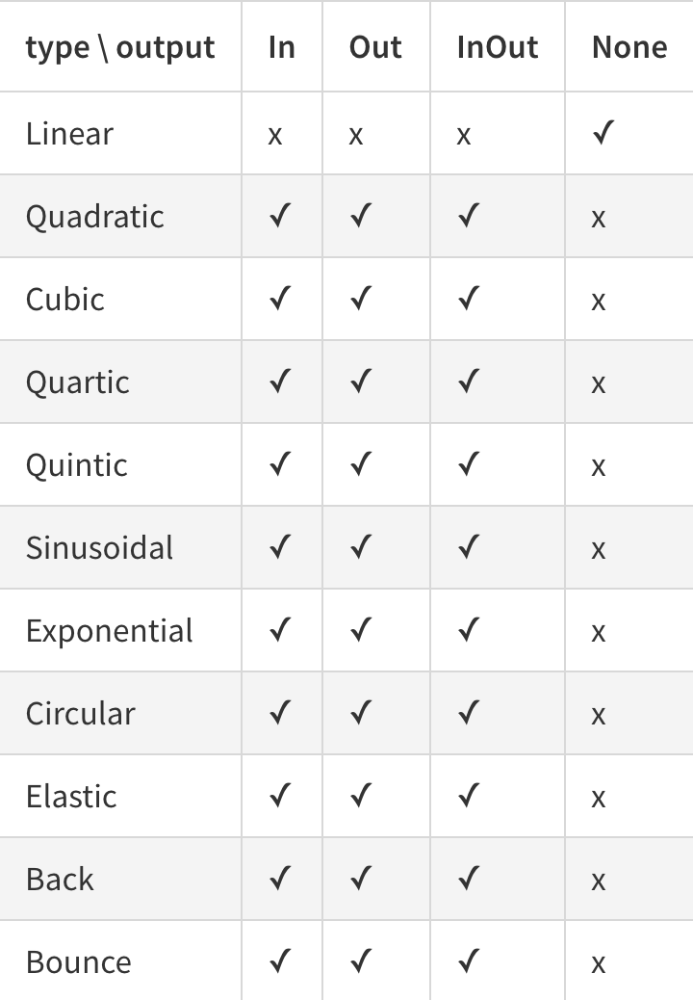

> Lightweight JavaScript (ES6) tweening library.

[](https://travis-ci.org/sasha240100/between.js)
[](https://www.npmjs.com/package/between.js)
[](https://github.com/sasha240100/between.js/blob/master/build/between.js)
[](https://github.com/sasha240100/between.js/blob/master/LICENSE)


[](https://nodei.co/npm/between.js/)

**EXAMPLES**
* [Examples collection](http://between.js.org/)

**DOCUMENTATION**
- [Purpose](#purpose)
- [Install](#install)
    - [With npm](#with-npm)
    - [Or fetch from CDN](#or-fetch-from-cdn)
- [Basic usage](#basic-usage)
    - [Module](#module)
    - [Or in HTML:](#or-in-html)
- [API](#api)
- [Events](#events)
- [Different values](#different-values)
- [Looping](#looping)
- [Easing](#easing)
- [Color](#color)
- [Mixed examples](#mixed-examples)

# Purpose

Make tweening usage convenient and powerful. There are certain things that we were following while developed this library, we wanted to make it:

- **Lightweight** :snowflake: JS Tweening library.
 > The library is only `9.08 Kb (3Kb gzip)`
- **Performant** :zap: JS Tweening library. 
 > It uses optimization patterns to speed up & smooth animation.
- **Modern** :gem: JS Tweening library
 > The library is written in `ES6`, compiled to ES5 for global browsers support and provides `ES6 API`.

# Install 
## With npm 

```
$ npm install between.js
```

## Or fetch from CDN

```
<script src="https://cdn.jsdelivr.net/npm/between.js/build/between.js"></script>
```

# Basic usage
## Module
```javascript
import Between from 'between.js';

// new Between(from, to).time(duration)
new Between(1, 10).time(1000)
  .on('update', (value) => { // This callback is executed in every frame
      console.log(value);
  });
```

## Or in HTML:

```html
<script src="./path/to/between.js"></script>
<script>
  new Between(1, 10).time(1000)
    .on('update', (value) => {
        console.log(value);
    });
</script>
```

# API

```js
// Constructor
new Between(
 [Number|Object|Array] from, 
 [Number|Object|Array] to
)

// Methods
  .time([Number] duration) // Set duration
  .loop([String] mode, [?Number] repeatTimes) // Set loop mode, if "repeatTimes" is falsy, treats as "endless"
  .easing([Function] easing) // Set easing function
  .on([String] eventName, [Function] callback) // Add event listener
  .pause() // Pauses
  .play() // Resumes

// Getters
  .isPaused // returns true if paused
```


> There is no need to "start" the tween. It is executed immediately once it was created.

# Events

```javascript
import Between from 'between.js';

new Between(1, 10).time(1000)
  .on('update', (value) => {
      console.log(value); 
  })
  .on('start', (value) => {
      console.log(value);
  })
  .on('pause', (value) => {
      console.log(value); 
  })
  .on('play', (value) => {
      console.log(value);
  })
  .on('complete', (value) => {
      console.log(value);
  });
```

# Different values

* Numbers
* Arrays
* Objects

**Numbers**

```javascript
import Between from 'between.js';

new Between(1, 10).time(1000)
  .on('update', (value) => {
      console.log(value);
  });
```

[Example](http://between.js.org/basic.html)

**Arrays**

```javascript
import Between from 'between.js';

new Between([1, 5], [10, 10]).time(1000)
  .on('update', (value) => {
      console.log(value);
   });
```

[Example](http://between.js.org/arrays.html)

**Objects**

```javascript
import Between from 'between.js';

new Between({x: 2, y: 3, z: 4}, {x: 4, y: 6, z: 10}).time(1000)
  .on('update', (value) => {
      console.log(value);
  });
```

[Example](http://between.js.org/objects.html)

# Looping

Repeat `N` times

```javascript
import Between from 'between.js';

new Between(1, 10).time(4000)
  .loop('repeat', N)
  .on('update', (value, {times}) => {
      console.log(value);
      console.log(times);
  });
```

[Example](http://between.js.org/loop-repeat.html)

Repeat endless

```javascript
import Between from 'between.js';

new Between(1, 10).time(4000)
  .loop('repeat')
  .on('update', (value) => {
      console.log(value);
  });
```

[Example](http://between.js.org/loop-repeat.html)

Bounce `N` times

```javascript
import Between from 'between.js';

new Between(1, 10).time(4000)
  .loop('bounce', N)
  .on('update', (value, {times}) => {
      console.log(value);
      console.log(times);
  });
```

[Example](http://between.js.org/loop-bounce.html)

# Easing

```javascript
import Between from 'between.js';
import Easing from 'easing-functions';

// choose easing mode frome easing-functions

new Between(1, 10).time(4000)
  .easing(Between.Easing.Cubic.InOut)
  .on('update', (value) => {
      console.log(value);
  });
```

[Example](http://between.js.org/easing.html)



[easing-functions npm](https://www.npmjs.com/package/easing-functions) 

# Color

Color types:

* HEX
* HSL
* RGB
* Words \(red, yellow...\)

```javascript
import Between from 'between.js';
import ColorPlugin from 'between.js/build/dom-color.between.js';

Between._plugins.color = ColorPlugin;

new Between('red', 'rgb(255,40,30)').time(4000)
  .on('update', (value) => {
      console.log(value);
  });
```

[Example](http://between.js.org/color-plugin.html)

Or in HTML:

```html
<script src="./path/to/between.js"></script>
<script src="./path/to/dom-color.between.js"></script>
```

# Mixed examples

```javascript
import Between from 'between.js';
import Easing from 'easing-functions';
import ColorPlugin from 'between.js/build/dom-color.between.js';

Between._plugins.color = ColorPlugin;

// choose easing mode frome easing-functions

new Between('red', 'rgb(255,40,30)').time(4000)
  .loop('repeat', 3)
  .easing(Between.Easing.Linear)
  .on('update', (value) => {
      console.log(value);
  });
```

```javascript
import Between from 'between.js';
import Easing from 'easing-functions';

// choose easing mode frome easing-functions

new Between(1, 10).time(4000)
  .loop('bounce', 3)
  .easing(Between.Easing.Cubic.InOut)
  .on('update', (value) => {
      console.log(value);
  });
```

```javascript
import Between from 'between.js';
import Easing from 'easing-functions';

// choose easing mode frome easing-functions

new Between(1, 10).time(4000)
  .loop('repeat', 4)
  .easing(Between.Easing.Elastic.In)
  .on('update', (value) => {
      console.log(value);
  })
  .on('complete', (value) => {
      console.log(value);
  });
```

